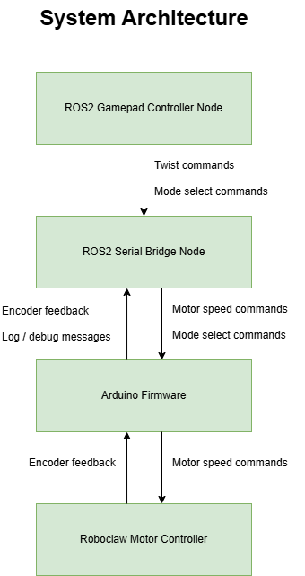

# Diff Drive Robot Platform — ROS2 + Arduino

Hands-on differential-drive robot platform integrating **embedded firmware** with a **ROS2 control stack** for motor control, telemetry, and debugging.  
The platform includes a **reproducible firmware build system**, a **binary serial protocol** for motor control, mode selection, encoder feedback, and logging, as well as **operational testing workflows**.

---

## Technologies
- ROS2
- Arduino / Embedded C++
- Roboclaw Motor Controller
- Linux, Ubuntu 24.04 VM
- Git / GitHub
- Serial communication protocols, telemetry, debugging

---

## System Overview



---

## Hardware

Example platform configuration:

- Differential drive robot base
- Wheel encoders
- Roboclaw motor controller
- PC with Ubuntu 24.04 VM running ROS2

---

## Key Features

### Binary Serial Protocol
- Single protocol for **motor commands**, **mode selection**, **encoder feedback**, and **debug/log messages**.
- Reduces bandwidth, ensures deterministic parsing, and maintains consistent message format across tasks.

### Reproducible Firmware Build System
- Tracks **source files**, **library versions**, and **unique build IDs** for each firmware build, enabling reproducible deployments and traceable debugging across multiple robots or test environments.

#### Runtime Build Identification
Each firmware build embeds metadata that is printed when the Arduino resets.
Example startup output:
```
===== Firmware Build Info =====
Build hash: 47ee1427b53c64dc0e0a8...
Build time: 2026-02-15 19:59:42 UTC
Lib hash: 07861a9d37d9d4d8d56c4...
```


### Operational Testing
- Hands-on testing of robot prototypes under ROS2 control.  
- Telemetry collection and feedback documentation to improve system performance.  
- Setup, teardown, and maintenance of testing environments.

### Debugging Infrastructure
- Firmware prints build info on reset.

---

## Future Improvements
- IMU integration for improved odometry and localization  
- Closed-loop velocity control  
- Integration with ROS2 navigation stack  

---

## License
This project is for educational and portfolio purposes.